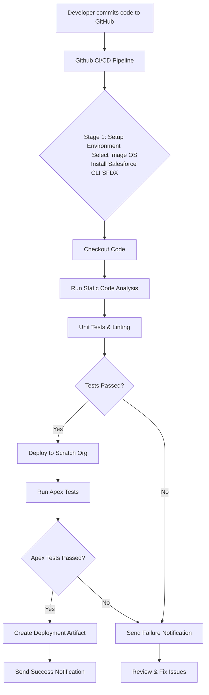

# Branching Workflow for Salesforce Development, Integration, and Production

## Table of Contents
1. [Overview](#Overview)
2. [Creating a Feature Branch](#creating-a-feature-branch)
3. [Pushing Code to GitHub](#pushing-code-to-github)
4. [Approve Pull Request (PR) from Feature Branch to Development](#approve-pull-request-pr-from-feature-branch-to-development)
5. [Squash and Merge to Development](#squash-and-merge-to-development)
6. [Creating a PR from Development to Integration](#creating-a-pr-from-development-to-integration)
7. [Squash and Merge to Integration](#squash-and-merge-to-integration)
8. [Process for Integration and Production](#process-for-integration-and-production)
9. [Conclusion](#conclusion)

## Overview
In this document, we will outline a detailed GitHub branching strategy and the process for Salesforce development.
This strategy will consist of three main branches:

Development (develop): Code changes are actively developed and tested here. This is the main working branch where new feature development happens.

Integration (integration): Code is tested for integration and acceptance testing. After merging into develop, the code is moved to integration for broader testing.

Production (main or master): The final branch where production-ready code is pushed. This is the stable branch with production-ready code.

### CI/CD Pipeline Design

## Creating a Feature Branch

When you start working on a new feature, the first step is to create a new branch from the develop branch.

### Steps:

1. Clone the Repository (if you haven't already):

    git clone https://github.com/your-org/salesforce-project.git
    cd salesforce-project

2. Switch to the develop Branch:

    git checkout develop
    git pull origin develop

3. Create a New Feature Branch: Use a descriptive name for the feature branch:

    git checkout -b feature/your-feature-name

    Example:

    git checkout -b feature/add-new-salesforce-trigger

## Pushing Code to GitHub

1. Make your necessary changes and commit the code:

        git add .
        git commit -m "Added new Salesforce trigger for X feature"

2. Push the branch to GitHub:

        git push origin feature/your-feature-name

## Approve Pull Request (PR) from Feature Branch to Development

After you push the code, a pull request (PR) should have been created to merge your feature branch into the develop branch.

1. Go to the GitHub Repository in your browser.

2. Navigate to the Pull Requests tab.

3. Click avaliable Pull Request.

4. Select the base branch as develop and the compare branch as feature/your-feature-name.

5. Add a description of the changes and click Create Pull Request.

6. Once the PR is created, an automated process will be triggered to build and validate the code in the Salesforce development sandbox. 

7. Our repository is configured to use GitHub Actions as CI/CD tool which is automated using Salesforce CLI (sfdx). Once the tests and validation succeed, the CI pipeline should mark the PR status as "Ready for Review."

## Squash and Merge to Development

1. Go to the PR in GitHub.

2. Click the Squash and Merge option.

Squashing combines all commits from the feature branch into one clean commit on the develop branch and this also create a PR from Development to Integration

3. Add a meaningful commit message for the merge.

4. Click Confirm Squash and Merge.

## Creating a PR from Development to Integration 

Once our feature branch is merged into the develop branch, Which also creates a pull request(PR) to integration branch.

1. Go to the GitHub Repository in your browser.

2. Navigate to the Pull Requests tab.

3. Click avaliable Pull Request.

4. Select the base branch as integration and the compare branch with development.

5. Add a description of the changes and click Create Pull Request.

6. Once the PR is created, an automated process will be triggered to build and validate the code in the Salesforce development sandbox. 

7. Our repository is configured to use GitHub Actions as CI/CD tool which is automated using Salesforce CLI (sfdx). Once the tests and validation succeed, the CI pipeline should mark the PR status as "Ready for Review."

## Squash and Merge to Integration

After the code has been tested and approved in the integration environment:

1. Go to the PR in GitHub.

2. Click the Squash and Merge option.

Squashing combines all commits from the developemnt branch into one clean commit on the integration branch and this also create a PR from Integration to production

3. Add a meaningful commit message for the merge.

4. Click Confirm Squash and Merge.

## Process for Integration and Production

Once our feature branch is merged into the Integration branch, As a final step creates a pull request(PR) to production branch.

1. Go to the GitHub Repository in your browser.

2. Navigate to the Pull Requests tab.

3. Click avaliable Pull Request.

4. Select the base branch as production and the compare branch with integration.

5. The build process is similar to the previous environments which validates with prodcution sandbox

6. Once validated in production the deployment include manual approvals no auto deploy using Squash and Merge.

7. Once the PR is reviewed and accepted, Squash and Merge the code to the production branch. Which only merges the code no deployment of code to rpoduction here.

8. Monitor the production environment for any issues post-deployment.

## Conclusion

This branching strategy enables a smooth flow of code changes from development through integration and finally into production. The key components are:

With Feature branches we isolated our work.

Pull requests with automated validation for each staging.

Squash and merge which will have cleaner commit history.

This process ensures the stability and reliability of code as it moves through various stages before being deployed into production.
